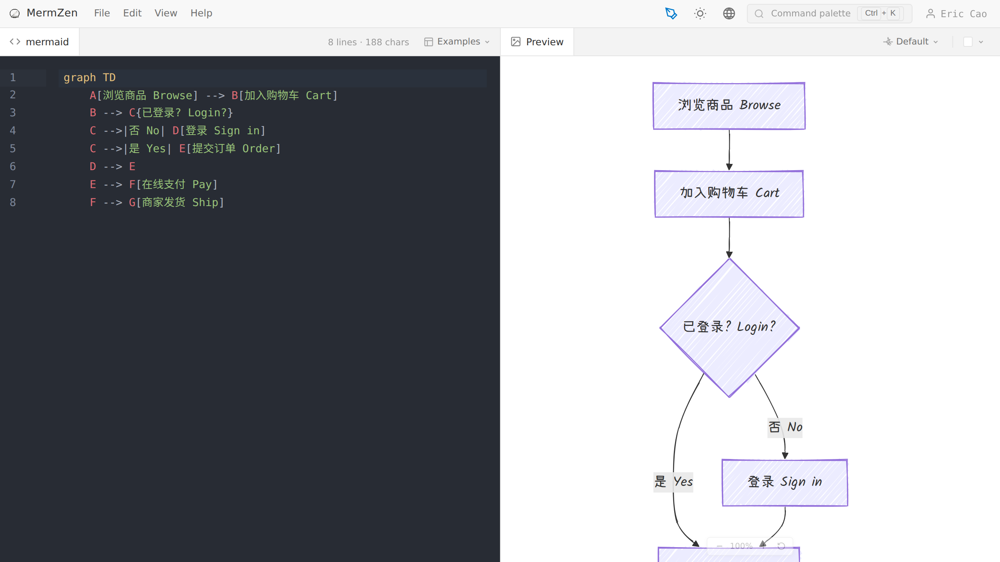
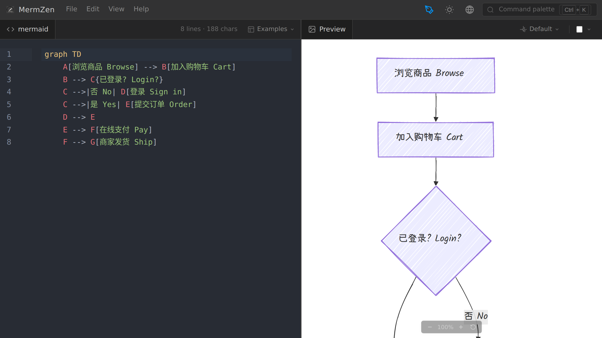
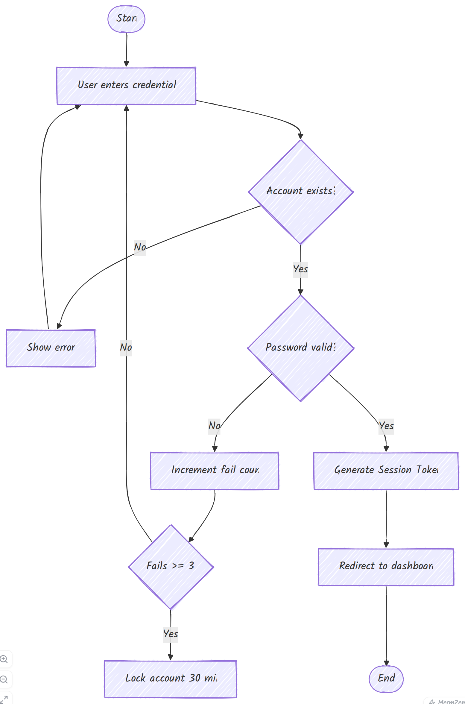
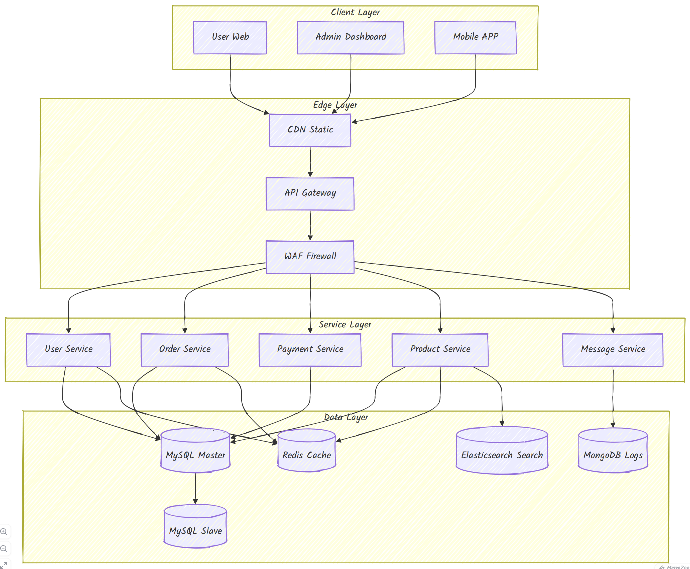
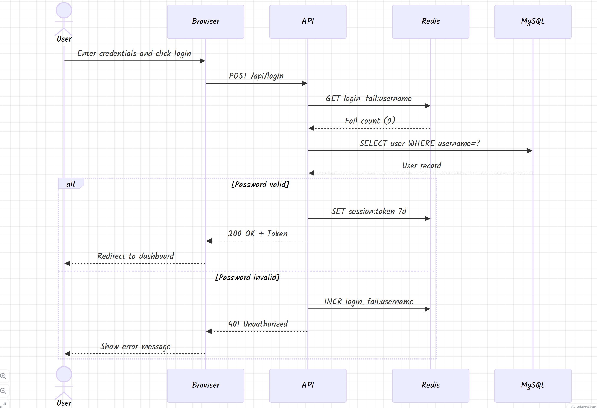

# MermZen

  

**MermZen** is an out-of-the-box Mermaid diagram editor. Open it, write syntax, see your diagram — that's the whole experience. No setup, no friction, just the diagram.

The name blends **Mermaid** (the diagram syntax) and **Zen** (simplicity). Design and lightness are the point.

**Live demo: [MermZen](https://eric.run.place/MermZen/)**

[中文文档](README.zh.md)

---

## Preview

### Editor Interface

  
  &nbsp;
  

### Feature Showcase

MermZen supports a rich set of themes and style combinations to easily meet different scenario needs:

  

    
  

  

    <h4>🎨 <a href="https://eric.run.place/MermZen/#eJxNjl9LwzAUR7_KJU8bOBD3NnCyrn_sFBE7H0bsQ0yuNqxL5CZuQrvvLktb7fM9v3Nuw45scXPFJFuwTxJfFWzjNwMAsJrwwgvy5RRmsyVE_NUhARqP5EASKjRei9qVHR4Fat2spLTfxgP-aOfd3bm7ri_X9sm2EPOisidAIkv9NO4CY3KHroWkeRbOnSwpOIpaq0GW_MlSnhtJeEDj4UPoGkK716ZBmzWp0LWD5S3MB0H237jnj1buQfRfz6_hoE05xi6daBwOu5xnaJCERyjQOW0NbO0eh2ke2hv-gkoTSg_eghKuereCVM9sAvMw4YlR5ZSdfwEosXhl" target="_blank">Hand-drawn Style + Default Theme</a></h4>
    <ul>
      <li>Smooth hand-drawn lines with built-in design sense</li>
      <li>Built-in Chinese and English handwriting font support</li>
      <li>Ideal for PPT presentations, blog illustrations, personal notes, etc.</li>
      <li>Exported images and SVGs include embedded fonts, display correctly everywhere</li>
    </ul>
  

  

    <h4>🌲 <a href="https://eric.run.place/MermZen/#eJx1kstugzAQRX9l5AUiUrrpkkUlwiMvSGhplYXbxQATQCJQ2U4iVPXfK3CqEpJ6Y917RnPHI3-xE7MepyxlFssFfhbw6r7XAADymGjDqUqqFQTYktCoOzZ_kyRgR8nHnznjdnYoa3BRFkmDIhswh4dNUlYEdhRdbKqzUZaX5TROcrnjbiBWqMp00M_jdrSEOSo6Yzvwfb6zffBLQWesqn-TYhKnMr0Jm-tnXeig7YJvRXaXLHmE7aFb0S1b8Ug02TG9x9Y8JCkxpxG7ndVFheNBA26GbfwcQIhSkZgMGoe_KK7wREOy4eYLZaUEB9Piimy5GTZ13rgzCJpcDlHETa9CqcpUEoq0W113Tcbj2mDADAxw4OHhCS6_yO2Fp4XXC18LvxdzMGABBizBgBUYsNbw2u4KAw2CXoTXVbpio811L7ZaaBKxKVPMYvtGkFRsyoqMWXusJH3_AL-200U" target="_blank">Standard Style + Forest Theme</a></h4>
    <ul>
      <li>Professional and clean standard line style</li>
      <li>Forest green theme, eye-friendly and beautiful</li>
      <li>Suitable for technical documentation, enterprise architecture diagrams, formal reports, etc.</li>
      <li>Supports 5 official themes, freely switchable</li>
    </ul>
  

  

    <a href="https://eric.run.place/MermZen/#eJx1kstugzAQRX9l5AUiUrrpkkUlwiMvSGhplYXbxQATQCJQ2U4iVPXfK3CqEpJ6Y917RnPHI3-xE7MepyxlFssFfhbw6r7XAADymGjDqUqqFQTYktCoOzZ_kyRgR8nHnznjdnYoa3BRFkmDIhswh4dNUlYEdhRdbKqzUZaX5TROcrnjbiBWqMp00M_jdrSEOSo6Yzvwfb6zffBLQWesqn-TYhKnMr0Jm-tnXeig7YJvRXaXLHmE7aFb0S1b8Ug02TG9x9Y8JCkxpxG7ndVFheNBA26GbfwcQIhSkZgMGoe_KK7wREOy4eYLZaUEB9Piimy5GTZ13rgzCJpcDlHETa9CqcpUEoq0W113Tcbj2mDADAxw4OHhCS6_yO2Fp4XXC18LvxdzMGABBizBgBUYsNbw2u4KAw2CXoTXVbpio811L7ZaaBKxKVPMYvtGkFRsyoqMWXusJH3_AL-200U" target="_blank"></a>
  

  

    <a href="https://eric.run.place/MermZen/#eJx9kl9LwzAUxb_KIQ-iaHEOQQhYmbPq8M_q2uGLILG9dsGazJvUoeJ3l7abTjZ9Ctz7yzknh3yIVyG7OyITUjh6qchkdKJVwer5zgDAVLHXmZ4q4zF2xKvTY7aztYtePIByzZEQv65DRpRrtzq-ektuLttx7RmE4dxEIjKeGBlTTsZrVTpsoLSFNi0-54Iw7MUDiXiYpNhVU727xPTiQRCGjbXEWZS29-8flS5l5YiNeqaWbJhgIXaqdFkxIbOV8djsbC3LNZElkugy6qeoZXB7Ho0iLBQPj1q8Ab816-eBKbOct2tVesTKuZnlHJllpsy3m5XoSZTCkXPaGuntExkc5L_R5eK6nQ6GF9hGWqM_3KKxIAzHDVir167wFhO7qIJKR7hlawpM5_H-iDW47o_-rnRdtP3OHsZGVX5iWb9T_k-4ZGJnIGY7_0xkcrEjHgohRcE6F59f9DDjOg" target="_blank"></a>
  

  

    <h4>🧩 <a href="https://eric.run.place/MermZen/#eJx9kl9LwzAUxb_KIQ-iaHEOQQhYmbPq8M_q2uGLILG9dsGazJvUoeJ3l7abTjZ9Ctz7yzknh3yIVyG7OyITUjh6qchkdKJVwer5zgDAVLHXmZ4q4zF2xKvTY7aztYtePIByzZEQv65DRpRrtzq-ektuLttx7RmE4dxEIjKeGBlTTsZrVTpsoLSFNi0-54Iw7MUDiXiYpNhVU727xPTiQRCGjbXEWZS29-8flS5l5YiNeqaWbJhgIXaqdFkxIbOV8djsbC3LNZElkugy6qeoZXB7Ho0iLBQPj1q8Ab816-eBKbOct2tVesTKuZnlHJllpsy3m5XoSZTCkXPaGuntExkc5L_R5eK6nQ6GF9hGWqM_3KKxIAzHDVir167wFhO7qIJKR7hlawpM5_H-iDW47o_-rnRdtP3OHsZGVX5iWb9T_k-4ZGJnIGY7_0xkcrEjHgohRcE6F59f9DDjOg" target="_blank">Hand-drawn Style + Grid Background</a></h4>
    <ul>
      <li>Grid background for easy alignment and proportional reference</li>
      <li>Supports four background types: white, black, transparent, grid</li>
      <li>Freely choose background type when exporting</li>
      <li>Grid background only shows in preview and export, does not affect SVG's transparent background</li>
    </ul>
  

<em>💡 Click the title to edit the corresponding diagram online, freely switch styles and themes</em>

---

## Why MermZen

Mermaid's official live editor is cluttered and overcomplicated: AI upsells, membership prompts, and redundant panels crowd the screen. The interface keeps growing heavier — you just want to write syntax and see a diagram, but instead you're navigating a product that has lost sight of that.

MermZen fills that gap: a CodeMirror 6 editor with Mermaid-aware syntax highlighting, inline error hints with line numbers, and a full keyboard shortcut system. Diagrams are encoded directly in the URL hash, so sharing requires no backend, no account, and no expiring links — just copy the URL.

---

## Features

**Editor**

- CodeMirror 6 with Mermaid syntax highlighting and autocomplete
- Inline error display pinpointed to the exact line
- Code formatter and command palette (`Ctrl+K`)
- Full keyboard shortcut system

**Preview**

- Live rendering as you type (300ms debounce)
- 11 diagram types: flowchart, sequence, class, Gantt, pie, mindmap, ER, state, architecture, gitGraph, block-beta
- Pan, zoom, and checkerboard background for transparent diagrams
- Right-click context menu for quick export

**Output**

- Export SVG or PNG (PNG rendered at 2× resolution)
- Copy PNG directly to clipboard
- Shareable URL — diagram state encoded in the URL hash, no server needed
- Embeddable iframe via `embed.html` — paste `<iframe src="…/embed.html#code">` into any page for a live, hand-drawn diagram with zero dependencies

**Appearance**

- Hand-drawn style mode (with Chinese handwriting font support)
- 5 Mermaid themes + dark / light UI toggle

**Onboarding**

- Built-in example templates
- Interactive tour for first-time users

---

## Keyboard Shortcuts

| Action | Shortcut |
| --- | --- |
| Save (choose format) | `Ctrl+S` |
| Copy PNG | `Ctrl+Shift+C` |
| Format code | `Ctrl+Shift+F` |
| Command palette | `Ctrl+K` |
| File / Edit / View / Help menu | `Alt+F/E/V/H` |
| Switch preview background | `Alt+1/2/3/4` |

## Tech Stack

- [Vite 7](https://vitejs.dev/) — build tool, dev server, and module bundler
- [TypeScript](https://www.typescriptlang.org/) — type safety (gradual migration, JS modules coexist)
- [Mermaid 11](https://mermaid.js.org/) — diagram rendering
- [CodeMirror 6](https://codemirror.net/) — code editor
- [SVGO](https://github.com/svg/svgo) — SVG optimization on export
- [pako](https://github.com/nodeca/pako) — deflate compression for shareable URLs

All production dependencies are bundled locally — no CDN required at runtime.
