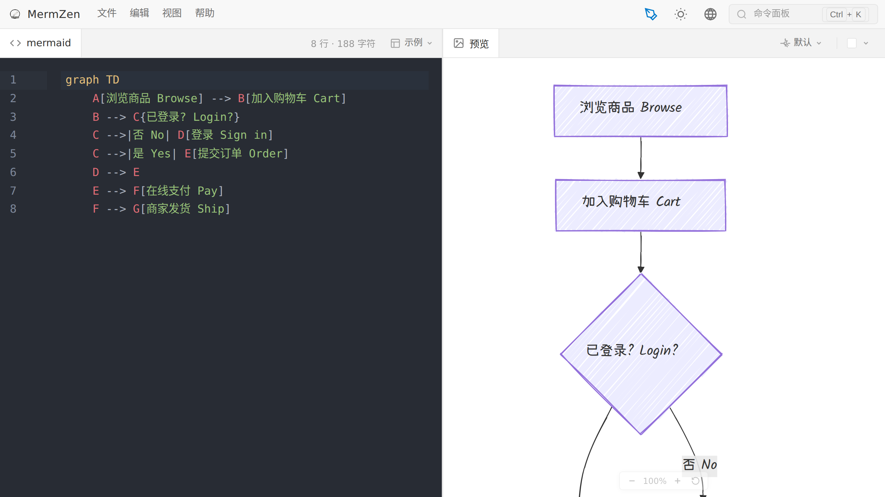
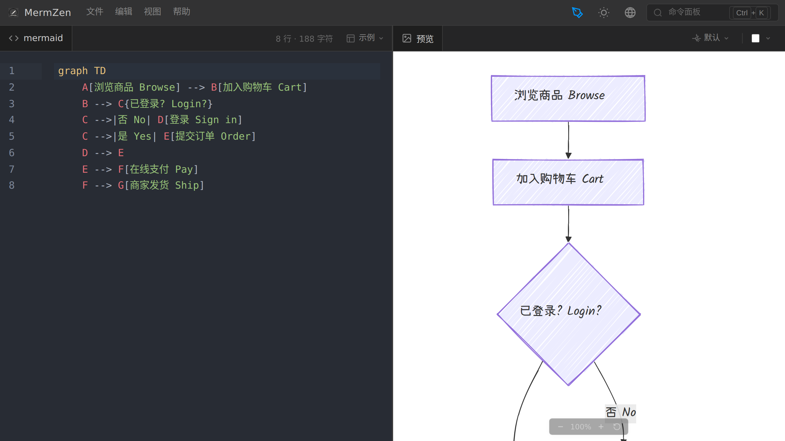
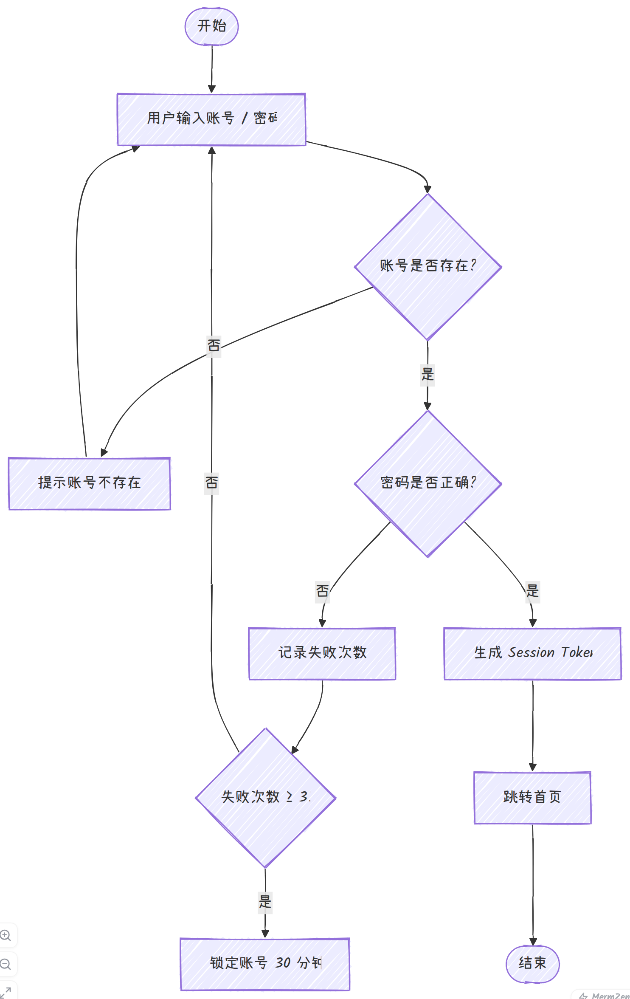
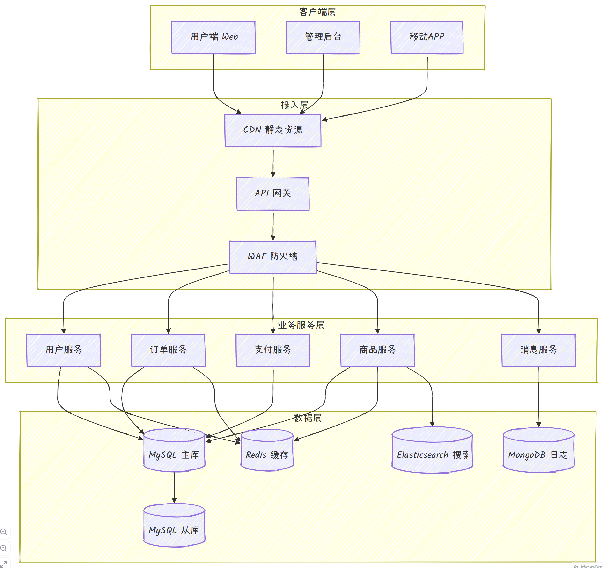
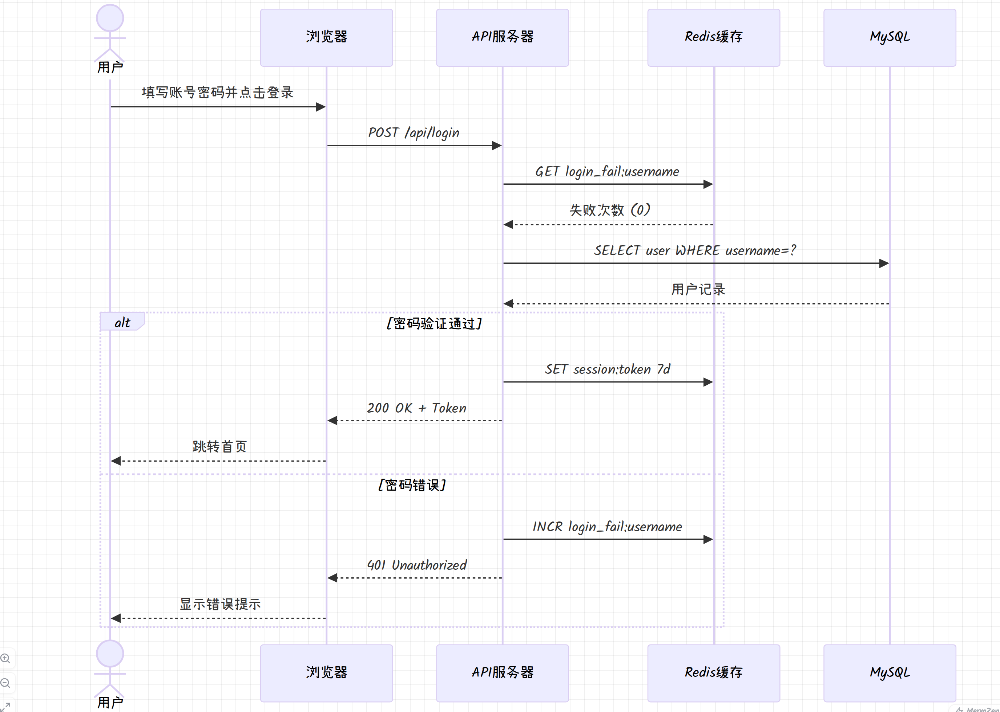

# MermZen

<p align="center">
  
</p>

[](https://github.com/caoergou/MermZen/actions/workflows/deploy.yml)
[](LICENSE)
[](https://github.com/caoergou/MermZen/stargazers)

**MermZen** 是一款开箱即用的 Mermaid 图表编辑器。打开即写，实时渲染，零干扰。

名字源于 **Mermaid**（图表语法）+ **Zen**（禅），追求极简设计与轻量体验。

**在线体验：[MermZen](https://eric.run.place/MermZen/)**

[English](README.md)

---

## 效果预览

### 编辑器界面

<p align="center">
  <a href="assets/editor-zh.png"></a>
  &nbsp;
  <a href="assets/editor-zh-dark.png"></a>
</p>

### 功能展示

MermZen 支持丰富的主题和风格组合，轻松满足不同场景需求：

<div style="display: flex; align-items: center; gap: 24px; margin-bottom: 40px;">
  <div style="flex: 1; text-align: center;">
    <a href="https://eric.run.place/MermZen/#eJxNj0FLwmAYx7_Kw04KSZE3D0Vzatoxb287REhFMCOhyybkIVlEOHLGiMRGbnnQzchYVPZhoufd9i2ivRN3_v_-v__zyNw5l1tf4Q64HHd4tn96BFVhTwIA2EoR_LrA52sxDZnMBvDE10dU9YLvLl5awczGjgergG7bf2yJrMNHZF5mKTVc1GycGPgw2mwyIv9PKKjZCgiEdjR_-MHg3_cbRsYqgY0mW9RwFSjIbJHJ6eTJN52FvLCUF0ngTHHew-FLMLPo2KS9aWwuRuaSnIzg58qC7MJTWs5tk1BvoXMf_5tdA1Tb4e1ATJLRIp-8IeqWia8PqKrBbq3ROK5LUK2f1KS4WY6uqJDAew3m49C-C823OKpE0U6K-J9d2h-Iaa75B8UPvnA" target="_blank"></a>
  </div>
  <div style="flex: 1;">
    <h4>🎨 <a href="https://eric.run.place/MermZen/#eJxNj0FLwmAYx7_Kw04KSZE3D0Vzatoxb287REhFMCOhyybkIVlEOHLGiMRGbnnQzchYVPZhoufd9i2ivRN3_v_-v__zyNw5l1tf4Q64HHd4tn96BFVhTwIA2EoR_LrA52sxDZnMBvDE10dU9YLvLl5awczGjgergG7bf2yJrMNHZF5mKTVc1GycGPgw2mwyIv9PKKjZCgiEdjR_-MHg3_cbRsYqgY0mW9RwFSjIbJHJ6eTJN52FvLCUF0ngTHHew-FLMLPo2KS9aWwuRuaSnIzg58qC7MJTWs5tk1BvoXMf_5tdA1Tb4e1ATJLRIp-8IeqWia8PqKrBbq3ROK5LUK2f1KS4WY6uqJDAew3m49C-C823OKpE0U6K-J9d2h-Iaa75B8UPvnA" target="_blank">手绘风格 + 默认主题</a></h4>
    <ul>
      <li>流畅的手绘线条，自带设计感</li>
      <li>内置中英文手写字体支持</li>
      <li>适合PPT演示、博客插图、个人笔记等场景</li>
      <li>导出的图片和SVG均包含内嵌字体，随处可正常显示</li>
    </ul>
  </div>
</div>

<div style="display: flex; align-items: center; gap: 24px; margin-bottom: 40px;">
  <div style="flex: 1;">
    <h4>🌲 <a href="https://eric.run.place/MermZen/#eJx1kltLAkEUx7_KYR4WA33p0Ydgdb3lbbuAD1MPXjYVRMO1ICLIyAhBM0zSsAcFKYjU7qFFX8aZqW8R7kjtas3b7_87nHNmmF20jazzZhRFVhTPhjcTsCqtpQEA1K0ID0i3TY9f2E2P3B1wNT4iZmfXPIeQEln_NTbMui1WOSKVMjnp64Qds6shKV6LsjxJlXRsahgtd0ihY5gkYbsUgK_LBt3Pfz4d0kFF19OBRdkD7P2UFB50sROHRCd81e9Z_oa0G_-OG71ekGKLNkuk2DIMdU2ux5Wusxt_dtukVJsRHkzPeqNhfUYsYlI7ItX8jPBi-nxM8z2D-ONJan1a6hq282GTf2dlyQej1yEZVOd0Tf0_alieUgFsWlZiSRXYW5Xc1vUqiE3-TDqekWxAzzvk41wvZWxypMJqLhlVlXA2mgBaabLH9tz0xiIIYAMB7GCxLMDkG0kaODg4NHBycGrgAgHcIIAHBFgEAbxcGuNxoY8LnwZ-YxWvCPDQq0GQAzcyMqMcsqKNTFZRc8iMEjFk3QinVGXvG8LREX4" target="_blank">标准风格 + 森林主题</a></h4>
    <ul>
      <li>专业清晰的标准线条风格</li>
      <li>森林绿色主题，护眼且美观</li>
      <li>适合技术文档、企业架构图、正式报告等场景</li>
      <li>支持5种官方主题，可自由切换</li>
    </ul>
  </div>
  <div style="flex: 1; text-align: center;">
    <a href="https://eric.run.place/MermZen/#eJx1kltLAkEUx7_KYR4WA33p0Ydgdb3lbbuAD1MPXjYVRMO1ICLIyAhBM0zSsAcFKYjU7qFFX8aZqW8R7kjtas3b7_87nHNmmF20jazzZhRFVhTPhjcTsCqtpQEA1K0ID0i3TY9f2E2P3B1wNT4iZmfXPIeQEln_NTbMui1WOSKVMjnp64Qds6shKV6LsjxJlXRsahgtd0ihY5gkYbsUgK_LBt3Pfz4d0kFF19OBRdkD7P2UFB50sROHRCd81e9Z_oa0G_-OG71ekGKLNkuk2DIMdU2ux5Wusxt_dtukVJsRHkzPeqNhfUYsYlI7ItX8jPBi-nxM8z2D-ONJan1a6hq282GTf2dlyQej1yEZVOd0Tf0_alieUgFsWlZiSRXYW5Xc1vUqiE3-TDqekWxAzzvk41wvZWxypMJqLhlVlXA2mgBaabLH9tz0xiIIYAMB7GCxLMDkG0kaODg4NHBycGrgAgHcIIAHBFgEAbxcGuNxoY8LnwZ-YxWvCPDQq0GQAzcyMqMcsqKNTFZRc8iMEjFk3QinVGXvG8LREX4" target="_blank"></a>
  </div>
</div>

<div style="display: flex; align-items: center; gap: 24px; margin-bottom: 20px;">
  <div style="flex: 1; text-align: center;">
    <a href="https://eric.run.place/MermZen/#eJyNkVtLAlEUhf_K5jwVOWQSBANNhA0V3XWgl16mcRiGbDS1IKKHiMKi8kGLjISGJrPwFmnS9dd0zhz_ReARm1Cx173XOutbZ--gLcR7XEhBPIqqG5uqoagTuqxF5PUVAwBAVmKhCNipHInX2CQsR2K6oodlIwakmqD3cZzOta_GF6fJ9Sk-NjtufWpAj9ofSVy4bF_ObfuXZtmYBXOC0ErigX4l8cEdrWRxooZLh_bNHn59sdPv-POcmVpaThCcGDwsLvglGJTD-mAwpOkGkzslnCA40HiYFCVgT2PriVbuSN4k52Xmcwi5tiSnHPrc_R2jGkV58IuzoldqdoXlKdEnAqs3OsZ8DWF7CHPQYrlVXQ7GgP0JKdzaZpFNe7X0ixJ8f1zRUub73bKPTmAEWw9drH9v4XG7YWEGBkAKranGr-X3BJwgMEweaO2Zfubr2Yu6WWVSNRhVm7z1VJqWSv_jnZ73-rqepQfxsHsIyPUjOYuTzH4PYHL5ZVtvTjLVCCAXWtUQj7SIHkC7P2CoiOQ" target="_blank"></a>
  </div>
  <div style="flex: 1;">
    <h4>🧩 <a href="https://eric.run.place/MermZen/#eJyNkVtLAlEUhf_K5jwVOWQSBANNhA0V3XWgl16mcRiGbDS1IKKHiMKi8kGLjISGJrPwFmnS9dd0zhz_ReARm1Cx173XOutbZ--gLcR7XEhBPIqqG5uqoagTuqxF5PUVAwBAVmKhCNipHInX2CQsR2K6oodlIwakmqD3cZzOta_GF6fJ9Sk-NjtufWpAj9ofSVy4bF_ObfuXZtmYBXOC0ErigX4l8cEdrWRxooZLh_bNHn59sdPv-POcmVpaThCcGDwsLvglGJTD-mAwpOkGkzslnCA40HiYFCVgT2PriVbuSN4k52Xmcwi5tiSnHPrc_R2jGkV58IuzoldqdoXlKdEnAqs3OsZ8DWF7CHPQYrlVXQ7GgP0JKdzaZpFNe7X0ixJ8f1zRUub73bKPTmAEWw9drH9v4XG7YWEGBkAKranGr-X3BJwgMEweaO2Zfubr2Yu6WWVSNRhVm7z1VJqWSv_jnZ73-rqepQfxsHsIyPUjOYuTzH4PYHL5ZVtvTjLVCCAXWtUQj7SIHkC7P2CoiOQ" target="_blank">手绘风格 + 网格背景</a></h4>
    <ul>
      <li>网格背景便于对齐和比例参考</li>
      <li>支持白色、黑色、透明、网格四种背景</li>
      <li>导出时可自由选择背景类型</li>
      <li>网格背景仅在预览和导出时显示，不影响SVG本身的透明背景</li>
    </ul>
  </div>
</div>

<p align="center"><em>💡 点击标题即可在线编辑对应图表，可自由切换风格和主题</em></p>

---

## 为什么做 MermZen

Mermaid 官方编辑器越来越臃肿：AI 推荐、会员弹窗、冗余面板占满屏幕。你只想写几行代码看个图，却要先绕过一堆干扰。

MermZen 回归本质：基于 CodeMirror 6，支持语法高亮、自动补全、行级错误提示；图表编码在 URL hash 中，分享无需后端、无需账号、链接永久有效。

---

## 主要功能

**编辑器**
- CodeMirror 6 编辑器，Mermaid 语法高亮与自动补全
- 行级错误提示，快速定位问题
- 代码格式化与命令面板（`Ctrl+K`）
- 完整快捷键支持

**预览**
- 实时渲染（300ms 防抖）
- 支持 11 种图表：流程图、时序图、类图、甘特图、饼图、思维导图、ER 图、状态图、架构图、Git 图、块图
- 缩放、平移、棋盘格背景
- 右键菜单快速导出

**输出**
- 导出 SVG 或 PNG（2× 分辨率）
- 复制 PNG 到剪贴板
- URL 分享——图表编码在 hash 中，无需服务器
- iframe 嵌入——把 Mermaid 文本 URL 编码后放进 `?text=` 即可（见下方 [嵌入](#嵌入)）

**外观**
- 手绘风格（含中文手写字体）
- 5 种 Mermaid 主题 + 深色/浅色 UI

**引导**
- 内置示例模板
- 交互式新手教程

---

## 嵌入

用一个普通 `<iframe>` 指向 `embed.html` 即可把任意图表嵌入网页、博客或文档。
嵌入页背景透明，可平移、可缩放，且无任何运行时依赖。

### 直接把文字丢进去（最简单，对 AI 友好）

将 Mermaid 源码 URL 编码后作为 `?text=` 传入——无需压缩、无需构建、无需安装：

```html
<iframe
  src="https://eric.run.place/MermZen/embed.html?text=graph%20TD%3B%20A--%3EB"
  width="100%" height="400" style="border:none"></iframe>
```

`?mermaid=`、`?diagram=` 是等价别名。可选样式参数：`theme`
（`default`/`dark`/`forest`/`neutral`/`base`）、`look`（`handDrawn`/`classic`）、
`bg`（`transparent`/`grid`/CSS 颜色）、`font`、`fontSize`。

```
embed.html?text=<编码后的文本>&theme=dark&look=classic&bg=grid
```

用代码构造 URL：

```js
const url = "https://eric.run.place/MermZen/embed.html?text=" +
  encodeURIComponent("graph TD; A-->B");
```

```python
import urllib.parse
url = "https://eric.run.place/MermZen/embed.html?text=" + \
    urllib.parse.quote("graph TD; A-->B")
```

### 用 postMessage 动态控制

无需重新加载即可重渲染，并让 iframe 自适应高度：

```js
const frame = document.querySelector('iframe');
frame.contentWindow.postMessage({
  type: 'mermzen:render',
  code: 'graph TD; A-->B',
  options: { theme: 'dark', look: 'classic' }
}, '*');

window.addEventListener('message', (e) => {
  if (e.data?.type === 'mermzen:rendered') {
    frame.style.height = e.data.height + 'px'; // 自适应高度
  }
});
```

嵌入页会回传 `mermzen:ready`、`mermzen:rendered`（`{ width, height }`）
和 `mermzen:error`（`{ error }`）。

### 紧凑分享链接

对于较长的图表，或想把样式设置打包进一个短 token，「复制嵌入代码」/ 分享
功能会生成压缩后的 `#hash`（pako deflate + base64）。完整格式见
[`public/llms.txt`](public/llms.txt)。

---

## 快捷键

| 操作 | 快捷键 |
| --- | --- |
| 保存（选择格式） | `Ctrl+S` |
| 复制 PNG | `Ctrl+Shift+C` |
| 格式化代码 | `Ctrl+Shift+F` |
| 命令面板 | `Ctrl+K` |
| 文件/编辑/视图/帮助 | `Alt+F/E/V/H` |
| 切换预览背景 | `Alt+1/2/3/4` |

## 技术栈

- [Vite 7](https://vitejs.dev/) — 构建工具与开发服务器
- [TypeScript](https://www.typescriptlang.org/) — 类型安全
- [Mermaid 11](https://mermaid.js.org/) — 图表渲染引擎
- [CodeMirror 6](https://codemirror.net/) — 代码编辑器
- [SVGO](https://github.com/svg/svgo) — SVG 优化
- [pako](https://github.com/nodeca/pako) — URL 压缩

所有依赖本地打包，运行时零 CDN 依赖。

