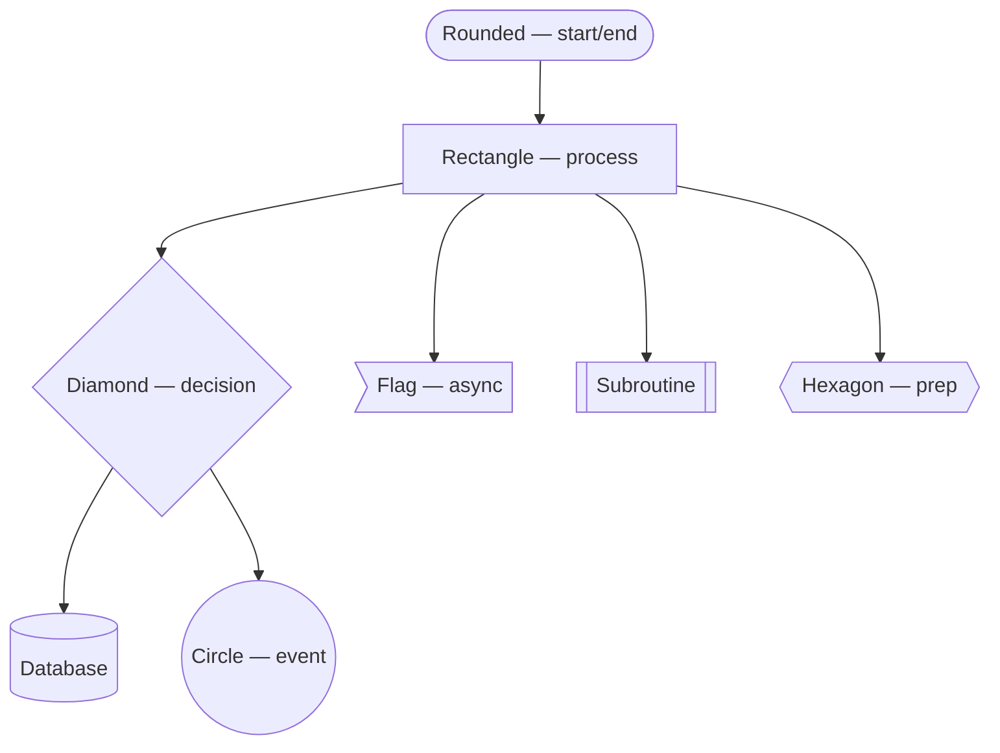
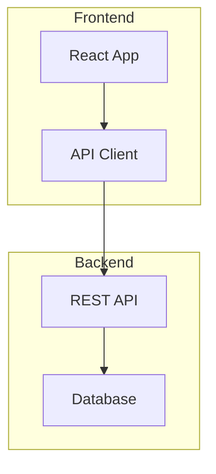
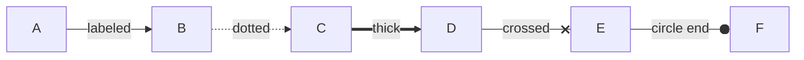
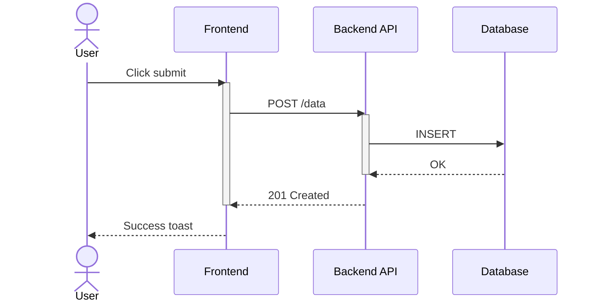

# MermZen Diagram Guide

## Supported Diagram Types

MermZen supports all Mermaid 11 diagram types:

| Type | Directive | Best for |
|------|-----------|----------|
| Flowchart | `graph TD` / `graph LR` | Processes, decision trees, workflows |
| Sequence | `sequenceDiagram` | API calls, message flows, protocols |
| Class | `classDiagram` | OOP design, data models |
| State | `stateDiagram-v2` | State machines, lifecycles |
| ER | `erDiagram` | Database schemas, entity relationships |
| Gantt | `gantt` | Project timelines, schedules |
| Pie | `pie` | Proportions, distributions |
| Mindmap | `mindmap` | Brainstorming, hierarchical concepts |
| Architecture | `architecture-beta` | System architecture, cloud infra |
| Git Graph | `gitGraph` | Branch strategies, release flows |
| Block | `block-beta` | Block diagrams, system layouts |
| Quadrant | `quadrantChart` | Priority matrices, 2D comparisons |
| Timeline | `timeline` | Chronological events |
| Sankey | `sankey-beta` | Flow quantities, energy/resource flows |
| XY Chart | `xychart-beta` | Bar/line charts, data visualization |
| Packet | `packet-beta` | Network packet structures |

## Tips for Better-Looking Diagrams

### Node shapes for visual hierarchy

Use different node shapes to distinguish node roles:

### Direction matters

- `graph TD` (top-down): best for hierarchical flows, decision trees
- `graph LR` (left-right): best for timelines, pipelines, sequential processes
- `graph BT` (bottom-up): best for build-up / dependency diagrams

### Keep it readable

- **5-15 nodes** is the sweet spot. Split larger diagrams into sub-diagrams.
- **Short labels** (2-4 words). Use line breaks for longer text: `A["Line one Line two"]`
- **Subgraphs** to group related nodes:

### Edge styling

### Hand-drawn style tips

The hand-drawn look works best with:
- **Simple shapes** — round, rectangle, diamond
- **Short labels** — long text in hand-drawn fonts can look crowded
- **Fewer crossing edges** — hand-drawn lines become harder to follow when they cross
- **Moderate node count** — 5-12 nodes per diagram for best visual impact

For formal documentation, use `--look classic` instead.

### Color and theming

Choose themes based on context:
- `default` — neutral, works everywhere
- `dark` — for dark backgrounds or slides
- `forest` — green tones, eye-friendly for docs
- `neutral` — minimal, professional
- `base` — high contrast, accessibility-friendly

### Background choices

- `transparent` — for embedding in docs/slides (default)
- `grid` — adds a subtle grid, great for presentations
- `white` / `#f8f9fa` — for standalone images
- `#1a1a2e` — dark background for dark-themed diagrams

### Sequence diagram best practices

- Use `actor` for humans, `participant` for systems
- Use `as` aliases to keep labels short
- Use `activate`/`deactivate` to show processing time
- Solid arrows (`->>`) for requests, dashed (`-->>`) for responses

### CJK content tips

Chinese/Japanese/Korean text works out of the box. Tips:
- Keep CJK labels to **2-6 characters** — the Xiaolai SC font is wider than Latin
- Mix CJK and English freely: `A[用户 User]`
- For quadrant charts with CJK labels, MermZen automatically handles the preprocessing
