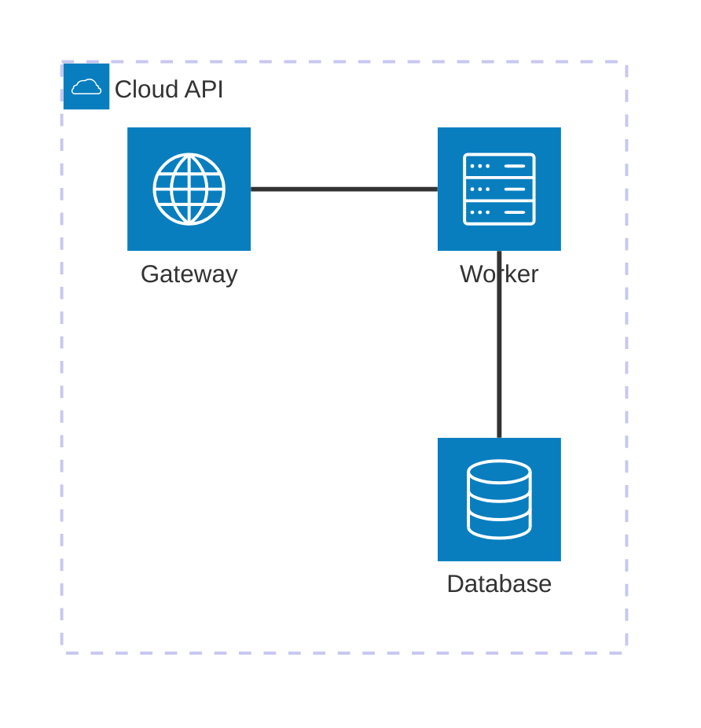

# Architecture Diagrams (`architecture-beta`)

This is the diagram type most likely to come out looking messy, and it's
usually a genuine engine limitation, not a syntax mistake — read this before
using it.

## Syntax

- `group id(icon)[Title]` — a labeled container. Nest with `group inner(icon)[Title] in outer`.
- `service id(icon)[Title] in groupId` — a node inside a group.
- **Edge anchors are mandatory, not optional.** Every edge needs an explicit
  side on both ends: `serviceA:R -- L:serviceB` (`T`/`B`/`L`/`R`). Omitting
  one is a **hard parse error**, not a rendering choice — there's no "default
  side" fallback.
- Arrowheads: `a:R --> L:b` (into b), `a:R <--> L:b` (both ends).
- Edge labels: `a:R -[My Label]- L:b`.
- Only **5 built-in icons exist**: `cloud`, `database`, `disk`, `internet`,
  `server`. Anything else (a specific cloud provider's icon, a queue, a load
  balancer icon) isn't available — pick the closest of the 5 and rely on the
  label text to convey the specific service.
- **Quote CJK labels.** `group sys(cloud)[我的系统]` breaks parsing; use
  `group sys(cloud)["我的系统"]`. This is different from flowchart, where
  unquoted CJK works fine — confirmed by testing both.
- `title` is **not** a valid top-level statement here — silently ignored,
  zero visual effect. Don't bother.

## The label-crossing problem

**Confirmed by direct testing: diagonal edges (e.g. a `B`-anchor to a
`T`-anchor across a horizontal offset) can be drawn straight through a
neighboring node's label**, even with fully correct anchor syntax. This
isn't a syntax bug — the underlying `cytoscape.js-fcose` layout engine
positions nodes without reserving clearance for edges that cross diagonally,
and there's no known syntax-level fix.

Concrete mitigations:

- **Prefer straight R-L and T-B edges over diagonal bends.** A diagonal edge
  (mixing horizontal and vertical anchors) is the one most likely to cut
  through a label.
- **Avoid fan-in from multiple directions into one node.** If two services
  both need to reach a third, the layout engine can't guarantee either edge
  avoids the third node's own label — this is exactly the "Gateway label
  crossed by a line to App Server" failure mode.
- **There's no `direction` statement and no manual grid positioning** on
  MermZen's pinned Mermaid version (the `align row`/`align column` directive
  that partially addresses node-collision issues landed in 11.15.0, after
  MermZen's pinned 11.13.0 — see [version-limits.md](../version-limits.md)).
  Layout is 100% automatic via a force-directed solver, so you cannot fix a
  bad layout by reordering declarations the way you can nudge a flowchart.
- **Don't nest groups.** Confirmed by testing: a `group` nested inside
  another `group` adds its own layout constraints on top of the parent's,
  measurably increasing the odds that an edge you wrote as straight (e.g.
  `a:B -- T:b`) ends up rendered diagonally anyway because the two services
  land at different horizontal offsets. A diagram with 3 nested sub-groups
  and label-crossing problems rendered perfectly clean once flattened to one
  group with the same services and edges. Prefer one flat group.

## When to use this vs. a flowchart

**Keep it small: ≤8 services, simple/near-linear topology.** Several
real-world AI-agent skill authors independently cap architecture-beta at
6-12 nodes before switching diagram types entirely.

**Use `graph TD` with `subgraph` blocks instead** when: the system has more
than ~8 services, several services all connect to a shared hub, or getting a
clean/predictable layout matters more than having cloud-style icons.
Flowchart won't have the icons, but it's far more reliable at scale and
gives you actual layout control (`direction`, subgraph grouping, node
ordering) that architecture-beta simply doesn't offer — see
[flowchart.md](flowchart.md)'s "Complex flowcharts" section for the
de-cluttering techniques that apply there instead.
