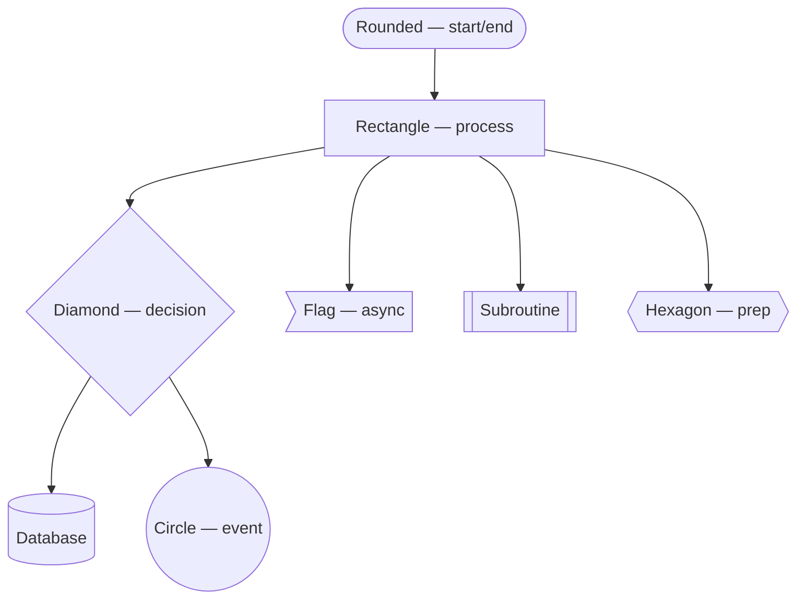
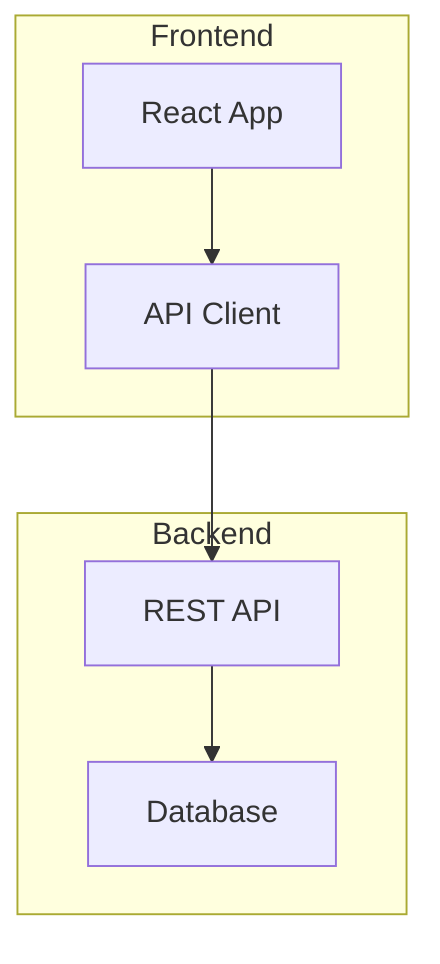
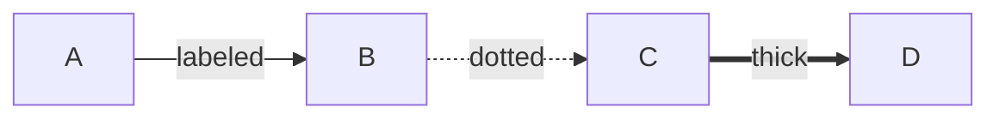

# Flowchart (`graph TD` / `graph LR`)

## How many nodes is too many?

Independent style guides converge on roughly the same thresholds:

- **≤15 nodes** — the sweet spot; stays easy to trace at a glance
- **~20 nodes** — hard warning line; strongly consider splitting
- **30+ nodes** — split into multiple diagrams, no exceptions

Mermaid's default `dagre` layout engine has known, unfixable-in-syntax
degradation on large diagrams: excessive whitespace padding and shrunken node
text (see [mermaid-js/mermaid#3262](https://github.com/mermaid-js/mermaid/issues/3262)).
There's no config that reliably fixes this — split the diagram instead of
trying to tune spacing.

**Hand-drawn style needs a stricter ceiling (~10-12 nodes).** The sketchy
rendering (via rough.js, the same library Excalidraw uses) adds positional
jitter to every line, and jitter scales with line length. Long or crossing
edges become noticeably harder to trace under hand-drawn rendering than under
crisp classic-style lines — the visual cues a reader normally uses (straight
lines, consistent angles) get blurred by the sketch noise. If a diagram is
dense, use `--look classic` instead of the hand-drawn default.

## Direction

| Direction | When to use |
|-----------|-------------|
| `TD` / `TB` | Hierarchies, decision trees, sequential processes with one dominant path — the default choice when unsure |
| `LR` | Pipelines, timelines, wide fan-outs (horizontal space is cheaper than vertical) |
| `BT` | Dependency chains / build-up flows leading to a goal |
| `RL` | Rare; right-to-left language contexts only |

Direction affects readability more than most other choices — if a layout
looks cramped or crossed, try changing direction before adjusting anything
else. **Never mix directions within one diagram.** If different sections
logically need different flow, use a `direction` statement inside a
`subgraph` instead — but see the subgraph limitation below.

## Node shapes (use consistently)

Shapes have standardized meanings (ISO 5807). Pick a convention and hold it
for the whole diagram — readers rely on shape consistency to parse a diagram
quickly:



- Diamond = decision (label the outgoing edges `Yes`/`No`, not just arrows)
- Cylinder = database/persistent storage specifically — state the actual
  operation in the label (`"Query users WHERE active"`), not a vague "Database"
- Rectangle = a process step doing one thing

## Keep labels short

- **2-4 words per label.** Long labels widen nodes and cause layout sprawl —
  wrap with `<br/>` instead of letting one node grow wide.
- **Label every edge out of a decision**, especially `-->|yes|` / `-->|no|`.
  Unlabeled branches force the reader to guess.

## Subgraphs: for named logical groups, not just tidiness

Use `subgraph` when a group of nodes has a real name ("Frontend," "Team A"),
not merely to visually cluster nearby nodes — the layout engine already
handles proximity on its own.



For composite/multi-team flows, treat each subgraph as a mini-flowchart with
one clear entry and one clear exit, and route only the module-to-module
handoff edges between subgraphs. This reads as "a few rooms, each with an
obvious door," instead of a pile of loosely grouped nodes.

**Known limitation**: a subgraph's own `direction` statement is silently
ignored if any node inside links to a node outside the subgraph — in that
case the subgraph just inherits the parent diagram's direction. Don't assume
`direction` inside a subgraph will "just work" if that subgraph also
connects to outside nodes.

**Syntax gotcha**: if a node inside a subgraph is also linked from outside,
don't additionally link to the subgraph's own ID — link to the inner node ID
directly. Linking to both can cause a parse error in some renderer versions.

## Complex flowcharts: concrete de-cluttering techniques

- **Cap the main "spine" length.** If the primary path is longer than ~8
  nodes, promote a chunk of it into a named subgraph. A short spine with a
  couple of named modules reads far better than one long chain.
- **Control fan-out.** When one node has many outgoing edges, the layout
  engine spreads them wide, blowing out the diagram's width. Insert an
  intermediate "router" node so the fan-out happens one level lower and stays
  narrower.
- **Isolate retry/loop edges.** Cycles (retry loops, back-edges) are exactly
  what forces diagonal edges to cross other edges — the single biggest cause
  of "which arrow goes where?" confusion. There's no syntax fix for this in
  Mermaid's default layout; consider splitting the happy path and the
  retry/error path into two separate diagrams instead of forcing both into one.
- **Match branch symmetry.** When a decision splits into two paths, keep both
  branches at the same visual depth with mirrored spacing. Asymmetric spacing
  unintentionally signals "one branch matters more."

## Edge styling



**Syntax gotcha — `linkStyle`: don't put the hex color last:**

```
# Can fail to parse — hex color as the last attribute
linkStyle 0 stroke-width:4px,stroke:#FF69B4

# Fix — reorder, or use a CSS color name
linkStyle 0 stroke:#FF69B4,stroke-width:4px
```

## Color and theme

- `default` — neutral, safe everywhere
- `dark` — for dark backgrounds or slides
- `forest` — green tones, easy on the eyes for docs
- `neutral` — minimal, professional
- `base` — the only theme where `themeVariables` actually take effect; use it
  if you need custom colors

**Use `classDef`, not repeated inline `style`, for anything reused.** Define
a class once, apply it with `class nodeId className` or `:::className`.
`classDef` must be declared *after* the nodes it targets. (`classDef` support
in other diagram types varies a lot — see
[general-syntax.md](../general-syntax.md).)

## Backgrounds (MermZen-specific)

- `transparent` — for embedding in docs/slides (default)
- `grid` — subtle grid, good for presentations
- Any CSS color / hex — for standalone images
