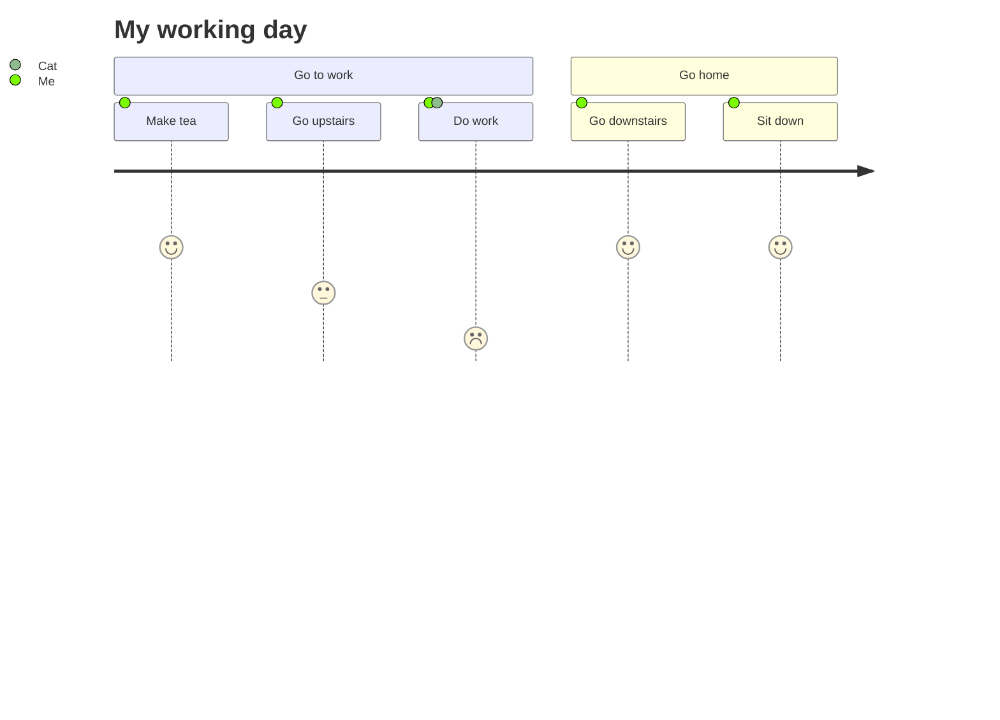

# User Journey (`journey`)

- `section <name>` groups related steps (rendered as a colored band above them).
- Each step line is `Task name: score: Actor1, Actor2`. The score is 1-5 and
  drives a mood-face icon below the timeline (1 = frown, 5 = big smile) — it's
  a satisfaction/happiness rating, not a duration or priority.
- Multiple actors on one step render as multiple colored dots on that step; a
  legend maps each actor name to its color automatically.
- CJK text works unquoted here (unlike architecture-beta and
  requirementDiagram, which need quotes) — confirmed by testing.

## Style tips

- Keep steps per section small (3-5) — a journey map is meant to be scannable
  at a glance, not a detailed process diagram. If you need that level of
  detail, use a flowchart instead.
- Use consistent actors across the whole journey (e.g. always "Me", not
  switching to "User" halfway) so the legend stays meaningful.
- Journey maps work best for **3-6 sections** covering a single end-to-end
  experience (a day, a purchase flow, an onboarding). Beyond that, split into
  multiple journeys per phase.
