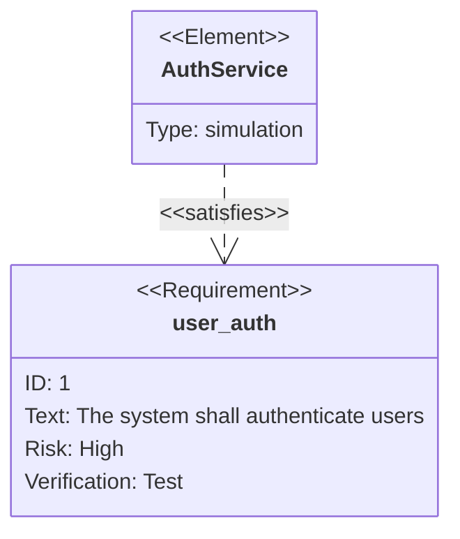

# Requirement Diagrams (`requirementDiagram`)

SysML-style requirements traceability: requirements, the elements that
satisfy/verify them, and how requirements relate to each other.

## Syntax

- A requirement block has **exactly 4 valid fields**: `id`, `text`, `risk`
  (`high`/`medium`/`low`), `verifymethod` (`analysis`/`inspection`/`test`/
  `demonstration`). There is no `type`, `status`, or `priority` field —
  confirmed by testing; these sound plausible but don't exist.
- Six requirement types, same fields, different semantic label:
  `requirement`, `functionalRequirement`, `performanceRequirement`,
  `interfaceRequirement`, `physicalRequirement`, `designConstraint`.
- `element id { type: ... }` defines a real-world thing that participates in
  relationships.
- Relationship syntax: `source - relationshipType -> target`. The only real
  relationship types are `satisfies`, `verifies`, `traces`, `contains`,
  `derives`, `refines`, `copies` — don't invent others like `requires` or
  `impacts`.

## Syntax gotchas — verified by testing

- **`title` breaks the render entirely** for this diagram type — unlike
  architecture-beta/block-beta, where an invalid `title` is just silently
  ignored. Never use `title` in a requirementDiagram.
- **CJK text must be quoted** in the `text:` field:
  `text: "系统应对用户进行身份验证"` works, `text: 系统应对用户进行身份验证`
  (unquoted) breaks the render. This is the opposite of flowchart, where
  unquoted CJK is fine.
- **Avoid the words `test`, `analysis`, `inspection`, `demonstration`** (the
  `verifymethod` enum values) appearing as standalone words inside an
  unquoted `text:` value — confirmed to collide with the grammar's keyword
  recognition and break parsing (e.g. `text: test text` fails,
  `text: hello world` doesn't).
- **Hyphens in attribute values** (e.g. `docref: some-doc`) can break
  parsing — avoid hyphens in attribute values.
- `requirement id { ... }` — the token right after `requirement` is a bare
  identifier, not a quoted display string. Put human-readable text in the
  `text:` field, not in the identifier position.

## When to use this

Only when you actually need SysML-style formal traceability (regulated or
safety-relevant projects — "which element satisfies which requirement").
For lightweight product requirements, a plain list or table is simpler and
faster to maintain than this diagram type.
