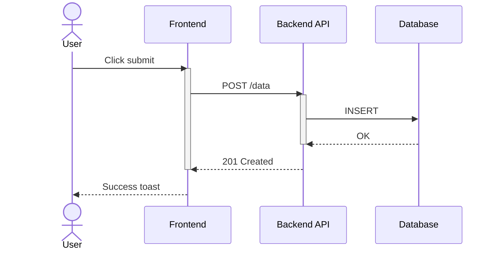

# Sequence Diagrams (`sequenceDiagram`)



## Style

- Order participants left-to-right by call chain: initiator on the far left,
  most-downstream dependency on the far right.
- `actor` for humans/external systems (stick figure), `participant` for
  internal services (box) — a real semantic distinction, not just cosmetic.
- Arrow semantics are meaningful, not decorative: `->>` synchronous/blocking,
  `-->>` response/return, `-)` async fire-and-forget, `-x` failed/terminated.
- Use `+`/`-` activation shorthand to show who's "busy" — helps surface
  bottlenecks visually.
- Group with `box` when there are more than ~4-5 participants, to avoid width
  cramping.
- Past ~15-20 messages or more than 2 levels of nested control flow (`alt`/
  `loop`/`par`), split into separate diagrams per major path.

## Syntax gotchas

**Participant names can't collide with keywords.** Mermaid's lexer matches
block keywords **case-insensitively**. Naming a participant `Loop`, `Note`,
or `Alt` collides with the `loop`/`note`/`alt` control-flow keywords and
breaks parsing:

```
# Breaks: "Loop" collides with the loop keyword
participant Loop

# Fix:
participant Loop_ as "Loop Service"
```

Avoid (case-insensitively): `loop`, `alt`, `opt`, `par`, `note`, `end`,
`activate`, `deactivate`, `rect`, `critical`, `break`.

**A literal `;` in message text** is read as a statement separator unless
escaped as `#59;`.

**`alt`/`else`: don't deactivate in both branches:**

```
# Breaks: only one branch executes, so the "other" deactivate
# throws "trying to inactivate an inactive participant"
alt success
    API->>DB: query
    DB-->>API: result
    deactivate API
else failure
    API->>DB: query
    DB-->>API: error
    deactivate API
end

# Fix: deactivate once, after the whole alt block
alt success
    API->>DB: query
    DB-->>API: result
else failure
    API->>DB: query
    DB-->>API: error
end
deactivate API
```

`rect` background-highlight blocks cannot be nested inside each other.

**Every `alt`/`opt`/`par`/`loop`/`rect` needs exactly one `end`** — a dropped
`end` on a deeply nested block is a common mistake. Count openers and
closers before rendering.

**`classDef`/`class` breaks the render entirely here** (parse error) — never
use it in a sequence diagram. See
[general-syntax.md](../general-syntax.md) for which diagram types actually
support it.
