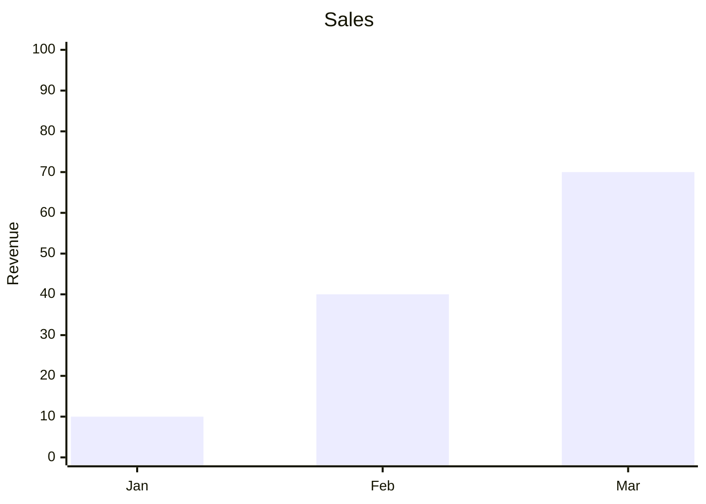

# XY Charts (`xychart-beta`)

- Supports multiple `bar`/`line` statements in one chart for combo charts.
- **No configurable outer margin/padding exists** — MermZen's own testing
  observed the last bar/tick can sit flush against the chart's right edge
  with no breathing room. This is a real characteristic of the diagram
  type's default styling, not a MermZen rendering bug — there's no
  `padding`/`margin` config to add space; the closest knob
  (`plotReservedSpacePercent`) controls plot-vs-label area ratio, not outer
  margin, and pushing it to its extreme can make clipping worse, not better.
- Bar width isn't independently configurable — more categories always means
  thinner bars, with no override. Keep category counts modest (Mermaid's own
  demo fixtures stress-test at 7 categories with long labels) and keep
  category labels short, since there's no built-in rotation/truncation for
  overflowing x-axis labels.
- Per-point line labels (`line [25, 45 "note"]`) are **not available** on
  MermZen's pinned Mermaid version — see
  [version-limits.md](../version-limits.md).
